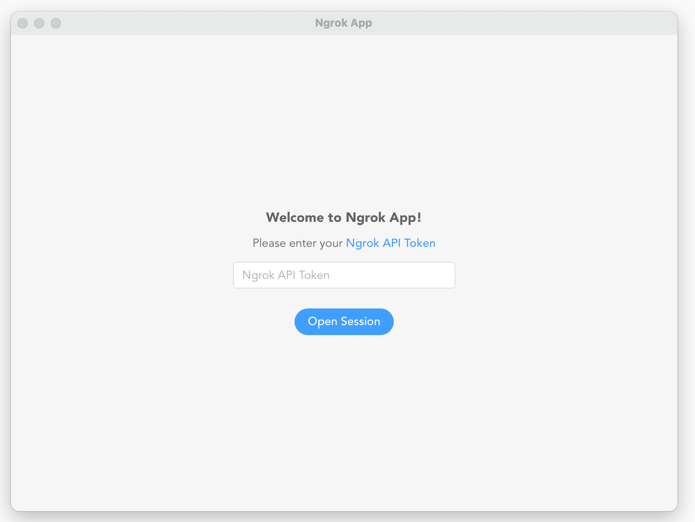
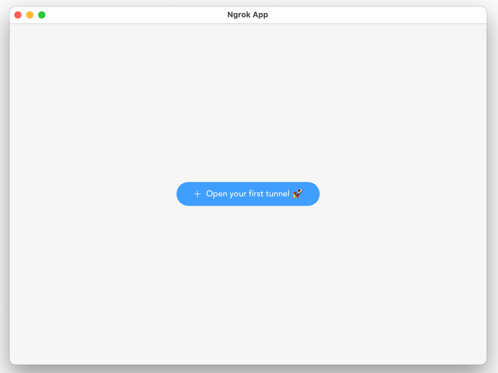
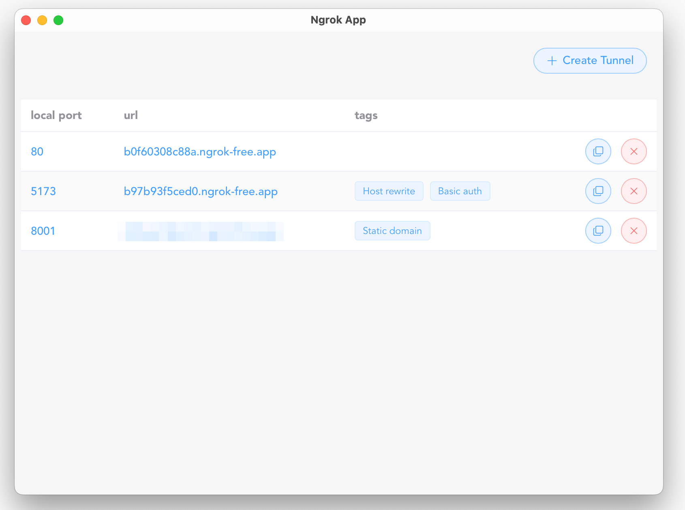

<div align="center">

# 🚀 Ngrok Desktop App

**A modern, native desktop application for managing ngrok tunnels with ease**

[](https://tauri.app/)
[](https://vuejs.org/)
[](https://www.typescriptlang.org/)
[](https://element-plus.org/)

*Effortlessly expose your local development servers to the internet*

</div>

## ✨ Features

- 🖥️ **Native Desktop Experience** - Built with Tauri for optimal performance and native feel
- ⚡ **Lightning Fast** - Instant tunnel creation and management
- 🎨 **Modern UI** - Beautiful, intuitive interface built with Vue 3 and Element Plus
- 🔧 **Advanced Configuration** - Support for custom domains, authentication, and headers
- 📋 **Easy Management** - View, copy, and manage all your tunnels in one place
- 🔒 **Secure** - Built-in support for basic authentication and custom headers
- 🌐 **Multiple Protocols** - Support for HTTP, HTTPS tunnels
- 📱 **Responsive Design** - Clean, modern interface that works on all screen sizes

## 🎯 Why Ngrok Desktop App?

**Perfect for developers who need:**
- Quick access to ngrok without command line complexity
- Visual management of multiple tunnels
- Advanced configuration options in a user-friendly interface
- Persistent tunnel history and management
- Professional presentation for client demos

## 📸 Screenshots

> *Screenshots will be added here*

<div align="center">
  
  
</div>

<div align="center">
  
  
</div>

## 🚀 Getting Started

### Prerequisites

- [Node.js](https://nodejs.org/) (v18 or higher)
- [Rust](https://rustup.rs/) (latest stable)
- [ngrok account](https://ngrok.com/) (free tier available)

### Installation

1. **Clone the repository**
   ```bash
   git clone https://github.com/Filipponik/ngrok-app.git
   cd ngrok-app
   ```

2. **Install dependencies**
   ```bash
   pnpm install
   ```

3. **Start development server**
   ```bash
   pnpm tauri dev
   ```

4. **Build for production**
   ```bash
   npm tauri build
   ```

## 💡 How to Use

### Creating Your First Tunnel

1. **Launch the app**, add Ngrok token and click "Create Tunnel"
2. **Enter your local port** (e.g., 3000 for a React app)
3. **Click "Create"** - your tunnel URL will be generated instantly!

### Advanced Configuration

**Custom Domains** 🌐
- Use your own subdomain (only one static domain is allowed for free ngrok accounts)
- Perfect for consistent URLs during development

**Request & Response Headers** 📋
- Add up to 9 custom headers per type
- Perfect for API development and testing
- Dynamic header management with easy add/remove

**Basic Authentication** 🔒
- Protect your tunnels with username/password
- Great for client demos and staging environments

**Host Rewriting** 🔄
- Modify the Host header for backend compatibility
- Essential for certain server configurations

### Managing Tunnels

- **View all active tunnels** in a clean, organized list
- **Copy URLs** with one click
- **Close tunnels** individually when done
- **Monitor tunnel status** in real-time

## 🛠️ Tech Stack

- **Frontend**: Vue 3 + TypeScript + Composition API
- **UI Framework**: Element Plus + Tailwind CSS
- **Desktop Runtime**: Tauri (Rust)
- **State Management**: Pinia
- **Build Tool**: Vite
- **Ngrok Integration**: Official ngrok Rust SDK

## 📋 Development

### Project Structure

```
ngrok-app/
├── src/                   # Vue.js frontend
│   ├── components/        # Reusable Vue components
│   ├── pages/             # Application pages
│   ├── services/          # API and business logic
│   └── assets/            # Static assets
├── src-tauri/             # Rust backend
│   ├── src/               # Rust source code
│   └── Cargo.toml         # Rust dependencies
└── package.json           # Node.js dependencies
```

### Available Scripts

```bash
pnpm tauri dev    # Run Tauri development mode
pnpm tauri build  # Build desktop application
```

### Contributing

We welcome contributions! Please feel free to submit a Pull Request. For major changes, please open an issue first to discuss what you would like to change.

## 🙏 Acknowledgments

- [ngrok](https://ngrok.com/) for the amazing tunneling service
- [Tauri](https://tauri.app/) for the incredible desktop app framework
- [Vue.js](https://vuejs.org/) for the reactive frontend framework
- [Element Plus](https://element-plus.org/) for the beautiful UI components

---

<div align="center">

**Made with ❤️ for the developer community**

[Report Bug](https://github.com/Filipponik/ngrok-app/issues) · [Request Feature](https://github.com/Filipponik/ngrok-app/issues) · [Contribute](https://github.com/Filipponik/ngrok-app/pulls)

</div>
